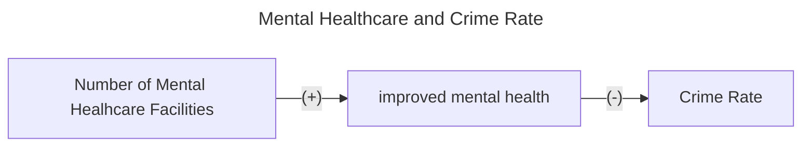
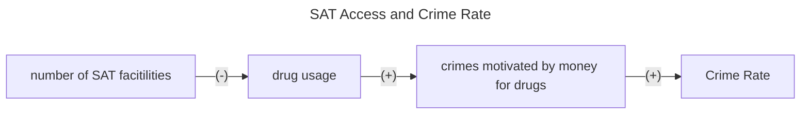

# First Paper Summary
___


- Citation (chicago style): Deza, Monica, Johanna Catherine Maclean, and Keisha Solomon. "Local access to mental healthcare and crime." Journal of Urban Economics 129 (2022): 103410. https://www.sciencedirect.com/science/article/abs/pii/S0094119021000929

- How we Found it: Professor Deza suggested it to us 

- Big Picture Question: Does having access to office-based mental healthcare reduce crime in the area? Can policymakers reduce crime rates by making office-based mental healthcare more accessible? 

- Theory / Conceptual Framework and Research Hypotheses: "Based on the literature, we hypothesize that as the number of mental healthcare offices increases within a county, crime rates will decline and improved mental health will be the channel through which crime is reduced. Any observed reductions in crime may be attributable to a reduced propensity to commit a crime or to be a crime victim."

### Causal Diagram 




# Second Paper Summary
___

- Citation: Bondurant, Samuel R., Jason M. Lindo, and Isaac D. Swensen. "Substance abuse treatment centers and local crime." Journal of Urban Economics 104 (2018): 124-133. 
- How we found it: Professor Deza recommended it on the "Information from Professor Deza" discussion tab. https://doi.org/10.1016/j.jue.2018.01.007 
- Big Picture Question: How does access to substance-abuse treatment (SAT) facilities affect local crime?
- Theory / Conceptual Framework: Access to SAT could reduce violence due to a) reducing drug usage, reducing aggressive behavior from drug use b) reducing crimes motivated by obtaining money for drugs c) reducing violence among those in the drug trade. SAT could also reduce violence induced by mental health problems, as large majority drug users have mental health problems. They use annual county-level data on the number of SAT facilities to evaluate the degree to which crime rates change when SAT facilities open and close. 
- Research Hypothesis: Expanding access to SAT facilities will reduce local crime, specfically for seriously violent and finanically motivated crimes. 

### Causal Diagram
   - Hypothesis: Expanding access to SAT facilities will reduce local crime, specfically for seriously violent and finanically motivated crimes.
      - Theory that supports this hypothesis: Access to SAT (Substance Abuse Treatment) could reduce violence due to a) reducing drug usage, reducing aggressive behavior from drug use b) reducing crimes motivated by obtaining money for drugs c) reducing violence among those in the drug trade. SAT could also reduce violence induced by mental health problems, as large majority drug users have mental health problems. They use annual county-level data on the number of SAT facilities to evaluate the degree to which crime rates change when SAT facilities open and close.
      



# Third Paper Summary 
___

- Citation: National Institute of Drug Abuse (2024). Wayne County (Detroit Area) Sentinel Community Site (SCS) Drug Use Patterns and Trends, 2020. Retrieved from: chrome-extension://efaidnbmnnnibpcajpcglclefindmkaj/https://ndews.org/wordpress/files/2020/08/SCS-Report-2020-Detroit-FINAL.pdf
- How we found it: We looked through google scholar to find papers that dealt with the types of drugs people used in detroit and how that changed over time along with where the reports came in. In the references for one of the papers we found, we found the citation for the version of this paper from 2016 that brought us to its most recent and relevent version: 2016
- Big Picture Question:
- Theory / Conceptual Framework: 
- Research Hypothesis:

### Causal Diagram
   - Hypothesis:
      - Theory that supports this hypothesis: 
      
```mermaid
---
title: SAT Access and Crime Rate
---
flowchart LR
 A[""] --(#45;)--> B[""]
 D[""]--(#43;)--> C[""]
B --(#43;)-->D
```


# Fourth Paper Summary 
- Citation: Messel, Matt, Isaac Swensen, and Carly Urban. "The effects of expanding access to mental health services on SS (D) I applications and awards." Labour Economics 81 (2023): 102339.  

# Fifth Paper Summary 
- Citation: Bandara S, Byrne L, Berman V, et al. Harm Reduction and Treatment Among People at High Risk of Overdose. JAMA Netw Open. 2024;7(8):e2427241. doi:10.1001/jamanetworkopen.2024.27241
