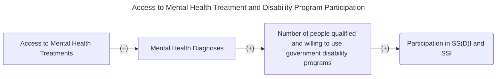
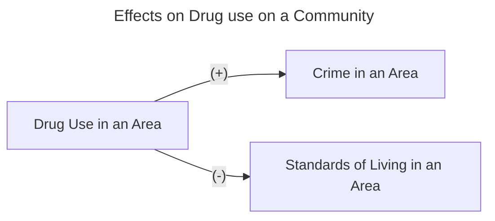

# First Paper Summary
___

- Citation: Deza, Monica, Johanna Catherine Maclean, and Keisha Solomon. "Local access to mental healthcare and crime." Journal of Urban Economics 129 (2022): 103410. https://www.sciencedirect.com/science/article/abs/pii/S0094119021000929
- How we Found it: Professor Deza suggested it to us 
- Big Picture Question: Does having access to office-based mental healthcare reduce crime in the area? Can policymakers reduce crime rates by making office-based mental healthcare more accessible? 
- Theory / Conceptual Framework and Research Hypotheses: "Based on the literature, we hypothesize that as the number of mental healthcare offices increases within a county, crime rates will decline and improved mental health will be the channel through which crime is reduced. Any observed reductions in crime may be attributable to a reduced propensity to commit a crime or to be a crime victim."

# Second Paper Summary
___

- Citation: Bondurant, Samuel R., Jason M. Lindo, and Isaac D. Swensen. "Substance abuse treatment centers and local crime." Journal of Urban Economics 104 (2018): 124-133. 
- How we found it: Professor Deza recommended it on the "Information from Professor Deza" discussion tab. https://doi.org/10.1016/j.jue.2018.01.007 
- Big Picture Question: How does access to substance-abuse treatment (SAT) facilities affect local crime?
- Research Hypothesis: Expanding access to SAT facilities will reduce local crime, specfically for seriously violent and finanically motivated crimes. 
- Theory / Conceptual Framework: Access to SAT could reduce violence due to a) reducing drug usage, reducing aggressive behavior from drug use b) reducing crimes motivated by obtaining money for drugs c) reducing violence among those in the drug trade. SAT could also reduce violence induced by mental health problems, as large majority drug users have mental health problems. They use annual county-level data on the number of SAT facilities to evaluate the degree to which crime rates change when SAT facilities open and close. 

      

# Third Paper Summary 
___
- Citation: Messel, Matt, Isaac Swensen, and Carly Urban. "The effects of expanding access to mental health services on SS (D) I applications and awards." Labour Economics 81 (2023): 102339. https://doi.org/10.1016/j.labeco.2023.102339 
- How we found it: Professor Deza recommended it to us, found on the "Information from Professor Deza" discussion tab.
- Big Picture Question: How does access to mental health treament services effect people's access to social safety nets, like Supplemental Security Income and the Social Security Disability Insurance (SS(D)I) programs?
- Research Hypothesis: An increase in accessibility to mental health facilities should increase participation in disability programs.
- Theory / Conceptual Framework: This paper builds on the relationship between mental health and labor market participation, and mental health services and participation in government disability programs. Firstly, easier access to mental health faciliites may increase the likelihood of proper diagnoses of SMI, which would likely increase the take-up of disability programs. Alternaltively, increased mental health help might help individuals obtain and maintain a job, increasing labor market paritcipation and decreseaing participation in disability programs. 

      

# Fourth Paper Summary 
- Citation: Bishai, David, Jody Sindelar, E. P. Ricketts, S. Huettner, L. Cornelius, J. J. Lloyd, J. R. Havens, C. A. Latkin, and S. A. Strathdee. "Willingness to pay for drug rehabilitation: implications for cost recovery." Journal of health economics 27, no. 4 (2008): 959-972.
- How we found it: google scholar after failing to find anything through the American Economic Association
- Big Picture Question: Does making drug rehabilitation and other preventative medicine centers more afforadable through government subsidies like medicare help the economy in the long run through a healthier workforce?
- Research Hypothesis: Are clients willing pay more for higher rates of treatment success and for the presence of case management?
- Theory/Conceptual Framework: This paper builds on the relationship between heroin users and their willingness to get/ follow through on treatment compared to how effective they know it can be and how expensive it will be

# Fifth Paper Summary 
- Citation: White, Helene R., and Dennis M. Gorman. "Dynamics of the drug-crime relationship." Criminal justice 1, no. 15 (2000): 1-218.
- How we found it: Found through Google Scholar in an effort to find a paper that focused more on the urban economics of the relationship between drug abuse and crime
- Big Picture Question: Does Drug Abuse Cause Crime or Vice Versa and to what extent do they cause one another
- Research Hypothesis: Is the Association Between Drug Use, Crime, and Standards of Living Causal?
- Theory/Conceptual Framework: The literature believes that without government/ outside intervention, drug use in an area causes crime in an area to increase and standards on living to decrease

Additional resources for contextualization:National Institute of Drug Abuse (2024). Wayne County (Detroit Area) Sentinel Community Site (SCS) Drug Use Patterns and Trends, 2020. Retrieved from: chrome-extension://efaidnbmnnnibpcajpcglclefindmkaj/https://ndews.org/wordpress/files/2020/08/SCS-Report-2020-Detroit-FINAL.pdf
