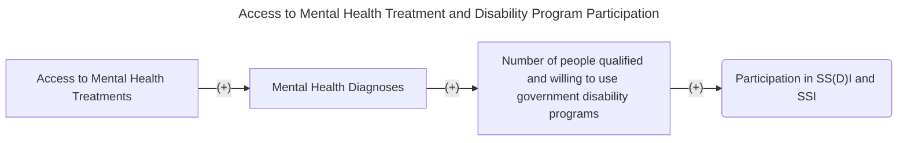
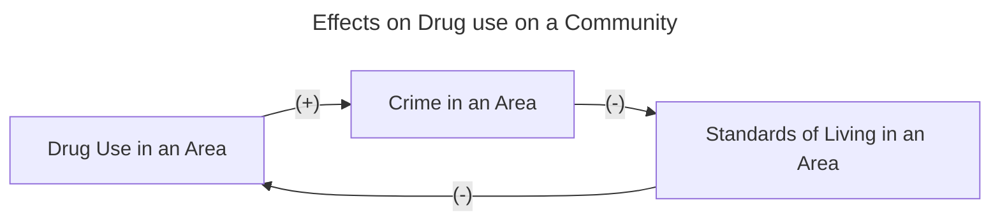
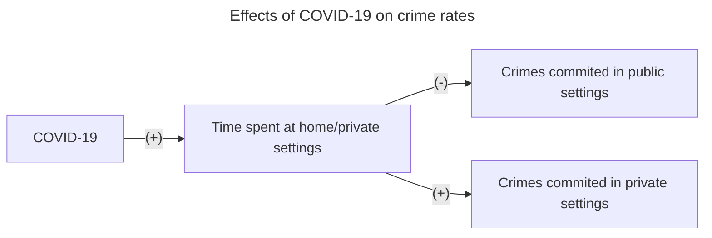
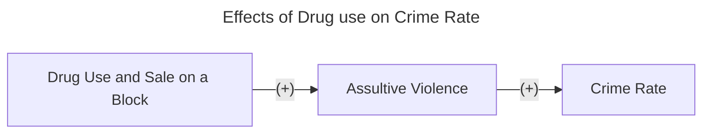
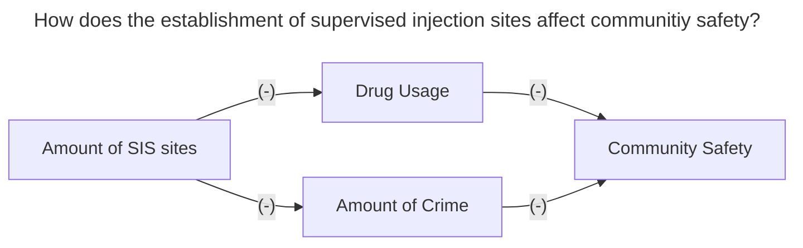

# First Paper Summary
___

- Citation: Deza, Monica, Johanna Catherine Maclean, and Keisha Solomon. "Local access to mental healthcare and crime." Journal of Urban Economics 129 (2022): 103410. https://www.sciencedirect.com/science/article/abs/pii/S0094119021000929
- How we Found it: Professor Deza suggested it to us 
- Big Picture Question: Does having access to office-based mental healthcare reduce crime in the area? Can policymakers reduce crime rates by making office-based mental healthcare more accessible? 
- Theory / Conceptual Framework and Research Hypotheses: "Based on the literature, we hypothesize that as the number of mental healthcare offices increases within a county, crime rates will decline and improved mental health will be the channel through which crime is reduced. Any observed reductions in crime may be attributable to a reduced propensity to commit a crime or to be a crime victim."

# Second Paper Summary
___

- Citation: Bondurant, Samuel R., Jason M. Lindo, and Isaac D. Swensen. "Substance abuse treatment centers and local crime." Journal of Urban Economics 104 (2018): 124-133. 
- How we found it: Professor Deza recommended it on the "Information from Professor Deza" discussion tab. https://doi.org/10.1016/j.jue.2018.01.007 
- Big Picture Question: How does access to substance-abuse treatment (SAT) facilities affect local crime?
- Research Hypothesis: Expanding access to SAT facilities will reduce local crime, specfically for seriously violent and finanically motivated crimes. 
- Theory / Conceptual Framework: Access to SAT could reduce violence due to a) reducing drug usage, reducing aggressive behavior from drug use b) reducing crimes motivated by obtaining money for drugs c) reducing violence among those in the drug trade. SAT could also reduce violence induced by mental health problems, as large majority drug users have mental health problems. They use annual county-level data on the number of SAT facilities to evaluate the degree to which crime rates change when SAT facilities open and close. 

      

# Third Paper Summary 
___
- Citation: Messel, Matt, Isaac Swensen, and Carly Urban. "The effects of expanding access to mental health services on SS (D) I applications and awards." Labour Economics 81 (2023): 102339. https://doi.org/10.1016/j.labeco.2023.102339 
- How we found it: Professor Deza recommended it to us, found on the "Information from Professor Deza" discussion tab.
- Big Picture Question: How does access to mental health treament services effect people's access to social safety nets, like Supplemental Security Income and the Social Security Disability Insurance (SS(D)I) programs?
- Research Hypothesis: An increase in accessibility to mental health facilities should increase participation in disability programs.
- Theory / Conceptual Framework: This paper builds on the relationship between mental health and labor market participation, and mental health services and participation in government disability programs. Firstly, easier access to mental health faciliites may increase the likelihood of proper diagnoses of SMI, which would likely increase the take-up of disability programs. Alternaltively, increased mental health help might help individuals obtain and maintain a job, increasing labor market paritcipation and decreseaing participation in disability programs. 

      

# Fourth Paper Summary 
- Citation: Bishai, David, Jody Sindelar, E. P. Ricketts, S. Huettner, L. Cornelius, J. J. Lloyd, J. R. Havens, C. A. Latkin, and S. A. Strathdee. "Willingness to pay for drug rehabilitation: implications for cost recovery." Journal of health economics 27, no. 4 (2008): 959-972. [https://www.nber.org/system/files/working_papers/w12506/w12506.pdf](https://www.nber.org/system/files/working_papers/w12506/w12506.pdf)
- How we found it: google scholar after failing to find anything through the American Economic Association
- Big Picture Question: Does making drug rehabilitation and other preventative medicine centers more afforadable through government subsidies like medicare help the economy in the long run through a healthier workforce?
- Research Hypothesis: Clients are willing to begin treatment's with higher rates of treatment success and an affordable cost.
- Theory/Conceptual Framework: This paper builds on the relationship between heroin users and their willingness to get/ follow through on treatment compared to how effective they know it can be and how expensive it will be

# Fifth Paper Summary 
- Citation: White, Helene R., and Dennis M. Gorman. "Dynamics of the drug-crime relationship." Criminal justice 1, no. 15 (2000): 1-218.
- How we found it: Found through Google Scholar in an effort to find a paper that focused more on the urban economics of the relationship between drug abuse and crime
- Big Picture Question: Does Drug Abuse Cause Crime or Vice Versa and to what extent do they cause one another
- Research Hypothesis: There is a positive feedback loop between higher drug use, higher crime, and lower standards of living in an area.
- Theory/Conceptual Framework: Higher crime in an area causes higher crime and lower standards of living because of the addictive properties of drugs and the numbing of decision making that occurs when someone is on opiods, weed, or psychadelics. When these people are in a state of poor decision making they are more willing to commit illegal activities and take from their communities to fuel their addictions. Furthermore, the paper states that in areas of higher crime and lower standards of living people have a higher tendency to use drugs as a means to escape from their situation. 

Additional resources for contextualization:National Institute of Drug Abuse (2024). Wayne County (Detroit Area) Sentinel Community Site (SCS) Drug Use Patterns and Trends, 2020. Retrieved from: chrome-extension://efaidnbmnnnibpcajpcglclefindmkaj/https://ndews.org/wordpress/files/2020/08/SCS-Report-2020-Detroit-FINAL.pdf

# Sixth Paper Summary 
- Citation: Hoeboer, C.M., Kitselaar, W.M., Henrich, J.F. et al. The Impact of COVID-19 on Crime: a Systematic Review. Am J Crim Just 49, 274–303 (2024). https://doi.org/10.1007/s12103-023-09746-4
- How we found it: Sophia went to the American Journal of Criminal Justice and looked for a research paper ananlyzing the relationship between crime rates and COVID-19.
- Big Picture Question: How did COVID-19 impact crime rates of different types of crime during it's initial period?
- Research Hypothesis: The social impact of COVID-19 will reduce crime rates since more people were confined to their homes.
- Theory/Conceptual Framework: COVID-19 increased the amount of time people spent in privately occupied places, which will decrease the amount of crimes commited in public settings, like robbery, homicide, pysical violence, etc. Alernatively, crimes commited in private settings like domestic violence will increase as people spend more time in private settings.

# Seventh Paper Summary 
- Citation: Contreras, Christopher, and John R. Hipp. "Drugs, crime, space, and time: A spatiotemporal examination of drug activity and crime rates." Justice Quarterly 37, no. 2 (2020): 187-209.
- How we found it: Found through Google Scholar in an effort to find a paper that focused more on the connection between drug usage and crimes related to drugs within neighborhoods 
- Big Picture Question: Does the drug activity on a city block impact the crime rate in that location through violence 
- Research Hypothesis: Excess crime in different blocks of Miami-Dade County, FLorida is caused by the rise in violence due to drug activity
- Theory/Conceptual Framework: When there is a rise is the sale or use of narcotics within a block radius in Miami-Dade County there will shortly be an increase in the amount of assultive violence which will cause an increase in the crime rate in those areas.

# Eighth Paper Summary 
- Citation: Review, Harvard Economics. 2020. “Supervision and Crime Rates.” Harvard Econ Review. September 5, 2020. https://www.economicsreview.org/post/supervision-and-crime-rates.
- How we found it: Found while looking through Harvard's Economic Review Journal
- Big Picture Question: How does the offer of guilt free help and providing sterile injection equipment for drug users affect crime and drug rates?
- Research Hypothesis: How does the establishment of supervised injection sites (SIS) affect community safety and crime rates?
- Theory/Conceptual Framework: As the opioid epidemic reached its peak in the United States, questions about the best response were raised. Debates soon turned to supervised injection sites (SIS). Already operating in Canada, parts of Europe, and Australia, there exists a large literature base concerning the safety and efficacy of these facilities. Several major cities in the United States are considering opening facilities in order to better address the drug problem. However, questions regarding the effect on drug use patterns, relapse rates, and crime rates have risen.

